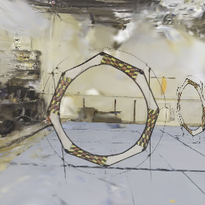

# Scripts for Abstract-Rendering-TOol 
### Chenxi Ji, chenxij2@illinois.edu, 01/30/2026

This repository contains the Abstract-Rendering tool for neural rendering and robust analysis.  
Follow the steps below to install and set up the environment.

---
## Setup

### 0. (Optional) Install Nerfstudio

The scene representation is required to follow the Nerfstudio data format. Therefore, installing Nerfstudio is recommended but not strictly required. You may either follow the installation commands provided in
`
nerfstudio_installation_commands.md
`
or refer to the official [Nerfstudio installation guide](https://docs.nerf.studio/quickstart/installation.html) (note that some steps on the website may be outdated).


### 1. Clone the Abstract-Rendering repository

Download the repository from GitHub:

```bash
cd ~
git clone --branch master https://github.com/IllinoisReliableAutonomyGroup/Abstract-Rendering.git
```

### 2. Install auto_LiRPA
Install the neural network verification library *auto_LiRPA*, and symbolic link it under the Abstract-Rendering dictionary.
```bash
cd ~
git clone --branch van_verify_fix_six https://github.com/Verified-Intelligence/auto_LiRPA.git
cd ~/Abstract-Rendering
cd ln -s ~/Verified-Intelligence/auto_LiRPA auto_LiRPA
```
**Note**: This is a hosted in granted by Prof. Huan Zhang.


### 3. (Optional) Download Scene Data
You may either use your existing Nerfstudio data or download the pre-reconstructed [Nerfstudio scenes](*https://drive.google.com/drive/folders/1koY1TL30Bty2x0U6VpszKRgMXk61oTkG?usp=drive_link*) and place them in the below dictionary structure.

```bash
~/Abstract-Rendering/nerfstudio/outputs/${case_name}/${reconstruction_method}/${datatime}/...
```

Below is visualization of scene *circle*.


## Examples

**Note**: The default GPU memory is 16GB. If you machine has less, please reduce the value of `gs_batch` in `config.yaml`.

---
### Normal Rendering
You can use the command below to render images from a specified set of waypoints in a given scene (e.g. *circle*):
```bash
cd ~/Abstract-Rendering
export case_name=circle
python3 python3 scripts/render_gsplat.py --config configs/${case_name}/config.yaml --odd configs/${case_name}/traj.json
```

The rendered image (*ref_######.png*) will be saved under `~/Abstract-Rendering/Outputs/RenderedIamges/${case_name}/${odd_type}`, for example:



### Abstract Rendering
You can use the command below to generate abstract images from a specified set of waypoints in a given scene (e.g. *circle*):
```bash
cd ~/Abstract-Rendering
export case_name=circle
python3 scripts/abstract_gsplat.py --config configs/${case_name}/config.yaml --odd configs/${case_name}/traj.json
```

The rendered images (*abstract_######.pt*) will be saved under 
`~/Abstract-Rendering/Outputs/AbstractIamges/${case_name}/${odd_type}`, and can be visualized by command, (e.g. *circle*):

```bash
cd ~/Abstract-Rendering
export case_name=circle
python3 scripts/vis_absimg.py --config configs/${case_name}/vis_absimg.yaml
```

The visualization of abstract image would be like 

where the top-left subfigure shows sample concrete image from the pose cell; the bottom-left/right subfigure shows lower/upper bound abstract images; the top-right subfigure shows per-pixel difference between bounds as a heatmap.


### Train Gatenet
```bash
cd ~/Abstract-Rendering
export case_name=circle
python3 scripts/train_gatenet.py --config configs/${case_name}/gatenet.yml --samples configs/${case_name}/samples.json
```

### Certify Gatenet
```bash
cd ~/Abstract-Rendering
export case_name=circle
python3 scripts/certify_gatenet.py --config configs/${case_name}/gatenet.yml
```

### Visualize Certificatio Results
```bash
cd ~/Abstract-Rendering
export case_name=circle
python3 scripts/plot_gatenet.py --config configs/${case_name}/gatenet.yml --traj configs/${case_name}/traj.yaml
```